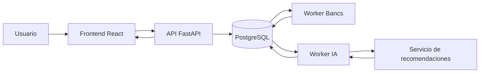
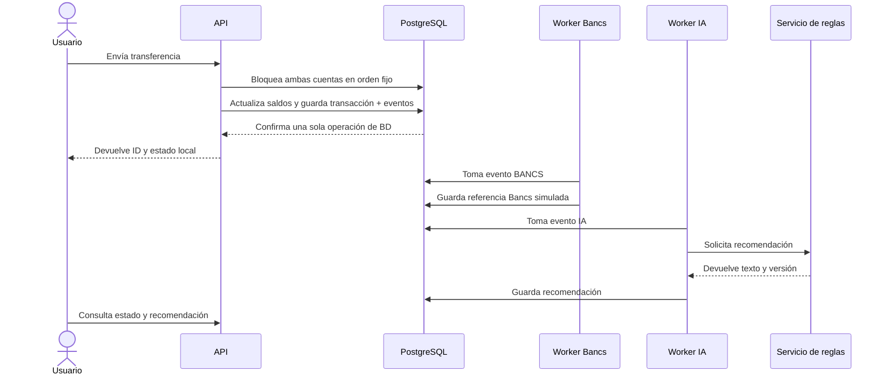
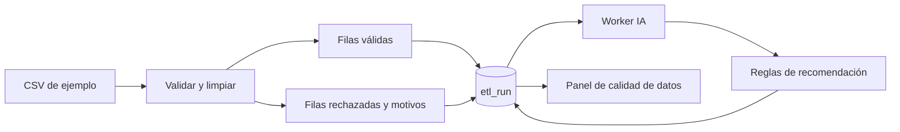

# Arquitectura

## Vista general

Docker Compose levanta estos componentes. La API atiende la transferencia; los workers realizan tareas posteriores. PostgreSQL conserva cuentas, transacciones, eventos, recomendaciones y ejecuciones ETL.

## Transferencia paso a paso

La transferencia y sus dos eventos se guardan en una misma transacción de base de datos. Si falla antes de confirmar, se revierten juntos. Las cuentas se bloquean en un orden estable para reducir conflictos concurrentes. La cabecera `Idempotency-Key` evita repetir una transferencia cuando el cliente reintenta la misma petición. Una clave reutilizada con datos distintos genera conflicto.

El resultado local `COMPLETADA` significa que PostgreSQL confirmó el movimiento en este MVP. La sincronización Bancs tiene un estado aparte; no equivale a una confirmación del core real. Si falla un worker, el evento se reintenta hasta cinco veces con esperas crecientes.

## Integración con Bancs

**Implementado:** el worker Bancs genera una referencia `BANCS-...` y marca el evento como completado. No hay conexión real con el core legado.

**Propuesta en un entorno real:** enviar a Bancs solo cambios confirmados mediante una cola o adaptador con ritmo limitado; agrupar cuando el contrato del core lo permita; usar claves idempotentes; registrar acuses de recibo; comparar periódicamente saldos y referencias para detectar diferencias. La aplicación leería sus propios datos para la pantalla, evitando consultar Bancs por cada visita. Una diferencia de conciliación se investigaría antes de considerarla resuelta.

## ETL y recomendaciones

El ETL toma `etl/etl_test_transaction.csv`, normaliza moneda y fechas, verifica montos e identificadores, y separa filas válidas y rechazadas. Cada ejecución se guarda en `etl_run` con un resumen de motivos. El worker de IA pide al servicio de reglas una recomendación basada en esos motivos; el frontend consulta el estado hasta recibirla.

Una fila puede presentar más de un motivo de rechazo; por eso la suma de motivos puede superar el número de filas rechazadas. Este ETL procesa un **CSV de muestra**, no importa esas filas a las cuentas ni actualiza saldos.

## Manejo de la «IA»

El servicio independiente `ai_service/` usa reglas sobre monto y frecuencia de transferencias, y sobre los motivos del ETL. No aprende de los datos ni predice fraude. Devuelve texto y una versión de reglas, lo que permite saber qué lógica produjo una recomendación. El worker llama al servicio después de confirmar la transferencia, de modo que una demora del servicio no bloquea la operación principal.

### Ciclo de vida del modelo en producción

Si el motor de reglas se sustituyera por un modelo entrenado, su operación se llevaría a cabo de la siguiente manera:

1. **Alimentación con datos nuevos.** Las transferencias confirmadas y los registros válidos del ETL podrían incorporarse periódicamente a un conjunto de datos de entrenamiento. 
Antes de usarlos habría que verificar su calidad, descartar información sensible que no sea necesaria y definir quién autoriza su uso. Cada conjunto de datos conservaría una versión y una fecha para poder reproducir el entrenamiento.
2. **Evaluación y publicación.** Una nueva versión del modelo se probaría con datos separados de los usados para entrenarlo y se compararía con la versión vigente. Solo se publicaría si cumple criterios previamente definidos de calidad, latencia y uso de recursos. El despliegue podría comenzar con una parte pequeña de las solicitudes y permitir volver a la versión anterior si aparecen problemas.
3. **Seguimiento del *data drift*.** Se compararían los datos recientes con los usados para entrenar el modelo, por ejemplo la distribución de montos, monedas, frecuencia de transferencias y porcentaje de datos incompletos. Si una diferencia se mantiene por encima de un umbral definido con datos históricos, se investigaría su causa y se evaluaría de nuevo el modelo. Un cambio en los datos no implicaría reentrenar automáticamente: primero habría que comprobar si también empeoraron las recomendaciones.
4. **Control de recursos.** Se medirían el tiempo de respuesta, la memoria, la CPU, la cantidad de solicitudes y la cola del worker de IA. Se establecerían límites de tiempo y capacidad para que una recomendación lenta o fallida no afecte a las transferencias. Cuando la demanda supere la capacidad disponible, las recomendaciones podrían esperar en la cola o procesarse con más instancias del servicio, según las mediciones.

## Datos y puntos de entrada

| Ruta | Uso |
| --- | --- |
| `GET /accounts` | Ver cuentas y saldos. |
| `POST /transactions` | Enviar una transferencia; requiere `Idempotency-Key`. |
| `GET /transactions/{id}` | Consultar la transferencia y Bancs. |
| `GET /transactions/{id}/recommendation` | Consultar la recomendación; puede devolver 404 mientras se genera. |
| `POST /etl/run` | Ejecutar el CSV de ejemplo y crear una solicitud de recomendación. |
| `GET /etl/runs/{id}` | Consultar filas, motivos y recomendación del ETL. |
| `GET /health` y `GET /metrics` | Estado de la API y métricas. |

Los detalles de campos y respuestas se pueden explorar en `http://localhost:8000/docs` con el entorno en marcha.
